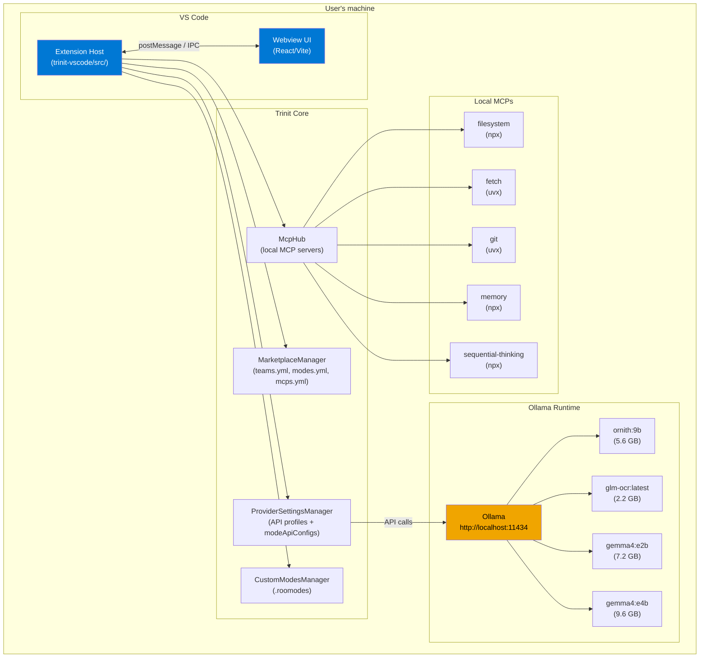
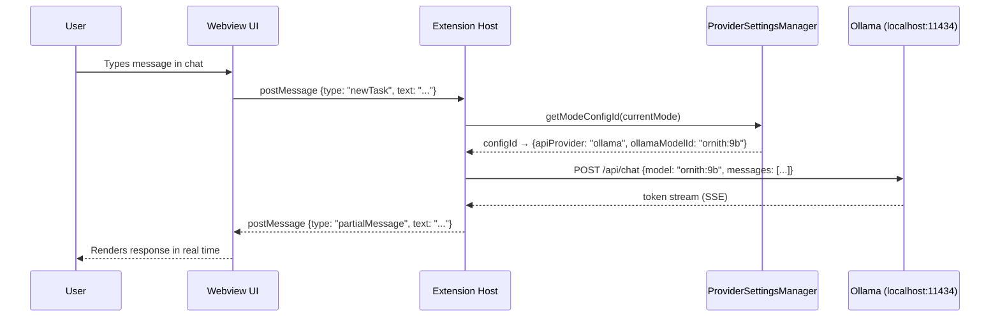
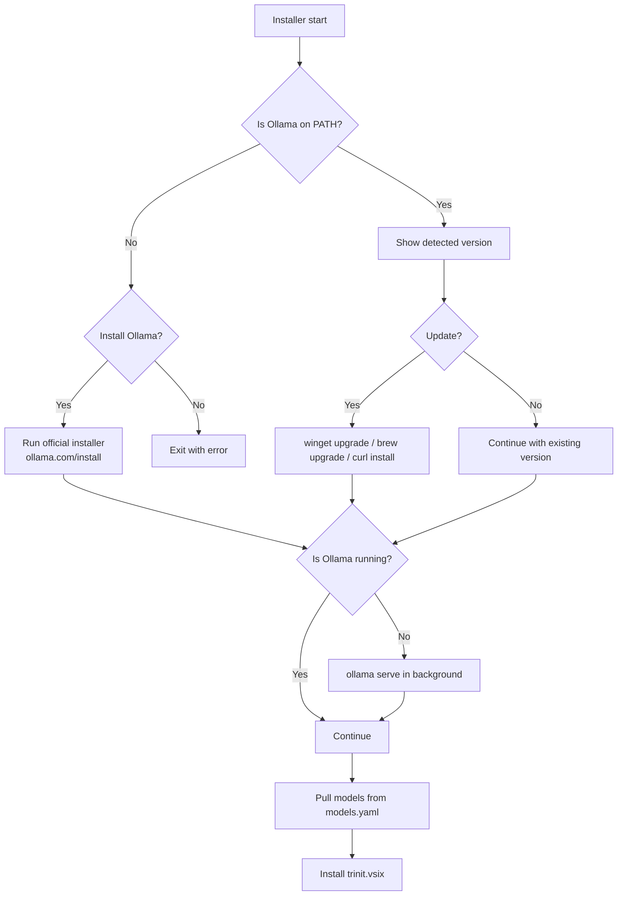

# Trinit — Technical Architecture

> Version: v0.1.0 · Date: 2026-07-04

---

## 1. System overview

Trinit is a **monorepo** composed of three main components that work together to deliver a complete local AI experience:

```
trinit/                        ← Root repository (monorepo)
├── trinit-vscode/             ← Submodule: VS Code extension (fork of Roo Code)
├── trinit-cli/                ← TypeScript CLI for model management and setup
├── trinit-core/               ← Core library: OllamaClient, ModelManager
├── models.yaml                ← Model manifest (source of truth)
├── install.ps1                ← Windows installer (one-liner)
└── install.sh                 ← macOS/Linux installer (one-liner)
```

### Submodule: trinit-vscode

The heart of Trinit is a fork of **Roo Code** (itself a fork of Cline), rebranded and modified to operate without login or cloud. It is in turn an internal monorepo with the following structure:

```
trinit-vscode/
├── src/                       ← VS Code extension host (TypeScript/Node.js)
│   ├── extension.ts           ← Entry point, activation
│   ├── core/webview/          ← ClineProvider: main orchestrator
│   ├── api/providers/         ← Per-provider handlers (ollama.ts, etc.)
│   ├── services/              ← MCP, marketplace, modes, auth (removed)
│   ├── shared/                ← Constants, localModeBindings.ts
│   └── assets/marketplace/   ← teams.yml, modes.yml, mcps.yml
├── webview-ui/                ← React/Vite frontend (VS Code side panel)
├── packages/
│   ├── types/                 ← Zod schemas + shared TypeScript types
│   ├── core/                  ← Platform-agnostic agent logic
│   ├── cloud/                 ← Neutralized stub (no active functionality)
│   ├── ipc/                   ← CLI ↔ extension communication
│   └── telemetry/             ← PostHog wrapper (disabled locally)
└── apps/
    ├── cli/                   ← Standalone agent CLI
    └── vscode-e2e/            ← Extension E2E tests
```

---

## 2. Component diagram



---

## 3. Local data flow

The entire data flow stays within the user's machine:



**Key points of the flow:**
- There are no calls to external servers in the default flow
- Ollama runs at `http://localhost:11434` (configurable via `ollamaBaseUrl`)
- Token streaming is local Server-Sent Events (SSE)
- Task history is persisted in VS Code's `globalStorage` (local)

---

## 4. Ollama integration

### Detection and startup

The installer (`install.ps1` / `install.sh`) detects whether Ollama is installed before proceeding:



### Communication with Ollama

The `src/api/providers/ollama.ts` handler uses the `ollama` npm package to communicate with the local daemon. The base URL is `http://localhost:11434` by default, configurable by the user.

Available models are discovered dynamically via `GET /api/tags` — Ollama is a `localProvider` in the model cache system, meaning it is queried directly without authentication.

---

## 5. Provider profile system and mode binding

The `ProviderSettingsManager` maintains a persistent map in VS Code's `SecretStorage`:

```typescript
// Simplified schema structure
{
  currentApiConfigName: string,
  apiConfigs: Record<string, ProviderSettings>,  // named profiles
  modeApiConfigs: Record<string, string>,         // modeSlug → configId
  modeApiConfigLocks: Record<string, boolean>,    // modeSlug → locked to local
}
```

The global **Full Local / Custom** toggle in `ModesView.tsx` calls two methods of `ProviderSettingsManager`:

- **`applyFullLocalPreset()`** — locks all modes (`modeApiConfigLocks[mode] = true`) and resolves each model from `LOCAL_MODE_BINDINGS` in `src/shared/localModeBindings.ts`:

```typescript
export const LOCAL_MODE_BINDINGS: Record<string, string> = {
    architect:    "ornith:9b",
    ocr:          "glm-ocr:latest",
    orchestrator: "ornith:9b",
    code:         "ornith:9b",
    debug:        "ornith:9b",
    ask:          "gemma4:e2b",
}
```

- **`applyCustomPreset()`** — unlocks `architect` and `orchestrator` by default, leaving the rest on local. The user can then assign any external provider to the unlocked modes, or unlock additional modes individually from the UI.

---

## 6. Teams and Marketplace system

The marketplace is **100% local** — there is no remote registry. Data is loaded from YAML files packaged inside the extension:

| File | Contents | Approx. size |
|---|---|---|
| `src/assets/marketplace/teams.yml` | Predefined teams (Trinit Core Team) | ~20 lines |
| `src/assets/marketplace/modes.yml` | Community mode catalog | 4,486 lines |
| `src/assets/marketplace/mcps.yml` | MCP server catalog | 3,032 lines |

The `MarketplaceManager` orchestrates loading via `ConfigLoader` and installation via `SimpleInstaller`. Installing a Team writes to `.roomodes` (project scope) or to the global `custom_modes.yaml`, and calls `setModeConfig()` to bind each mode to its corresponding Ollama model.

---

## 7. Predefined MCPs

On first activation, `seedDefaultMcpServers()` writes the following MCP servers to `mcp_settings.json` (VS Code global storage), all with no additional configuration:

| Server | Command | Purpose |
|---|---|---|
| `filesystem` | `npx @modelcontextprotocol/server-filesystem` | Access to the workspace filesystem |
| `fetch` | `uvx mcp-server-fetch` | HTTP requests from the agent |
| `git` | `uvx mcp-server-git` | Git operations |
| `memory` | `npx @modelcontextprotocol/server-memory` | Persistent memory across sessions |
| `sequential-thinking` | `npx @modelcontextprotocol/server-sequential-thinking` | Step-by-step reasoning |

Seeding is **strictly once** (tracked by `mcpDefaultsSeeded` in `globalState`) — if the user removes a server, it does not reappear on the next activation.

---

## 8. Fork lineage

```
Cline (original)
    └── Roo Code (fork with multi-mode, marketplace, cloud)
            └── Zoo Code (intermediate rebrand)
                    └── Trinit (current fork — rebrand completed)
                            ├── Auth/login removed
                            ├── Ollama as default provider
                            ├── 6 modes with local binding
                            ├── Teams marketplace
                            └── Predefined MCPs
```

The Roo Code → Trinit rebrand is **complete**: ~762 files renamed/updated, packages migrated from `@roo-code/*` to `@trinit/*`, 18 locales updated, `roleDefinitions` set to "You are Trinit", and all commits pushed. `zoo-code-index.md` is a historical document planning the rebrand process; it does not reflect the current state of the code.

---

## 9. Build and packaging

| Tool | Use |
|---|---|
| `pnpm` | Package manager (monorepo workspace) |
| `turbo` | Parallel build pipeline |
| `esbuild` | Extension bundler (`src/esbuild.mjs`) |
| `vite` | React webview build (`webview-ui/vite.config.ts`) |
| `tsc` | TypeScript compilation for the CLI |

The final artifact is `trinit.vsix`, distributed via GitHub Releases. The extension is installed with `code --install-extension trinit.vsix`.
