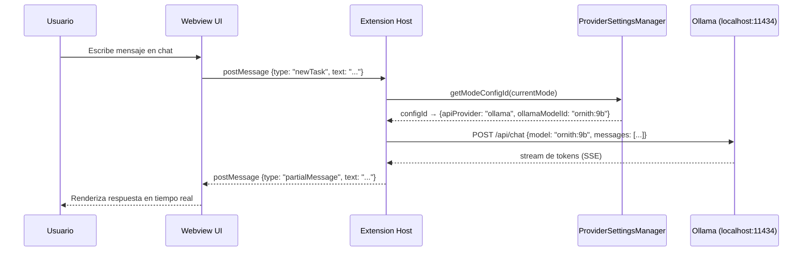
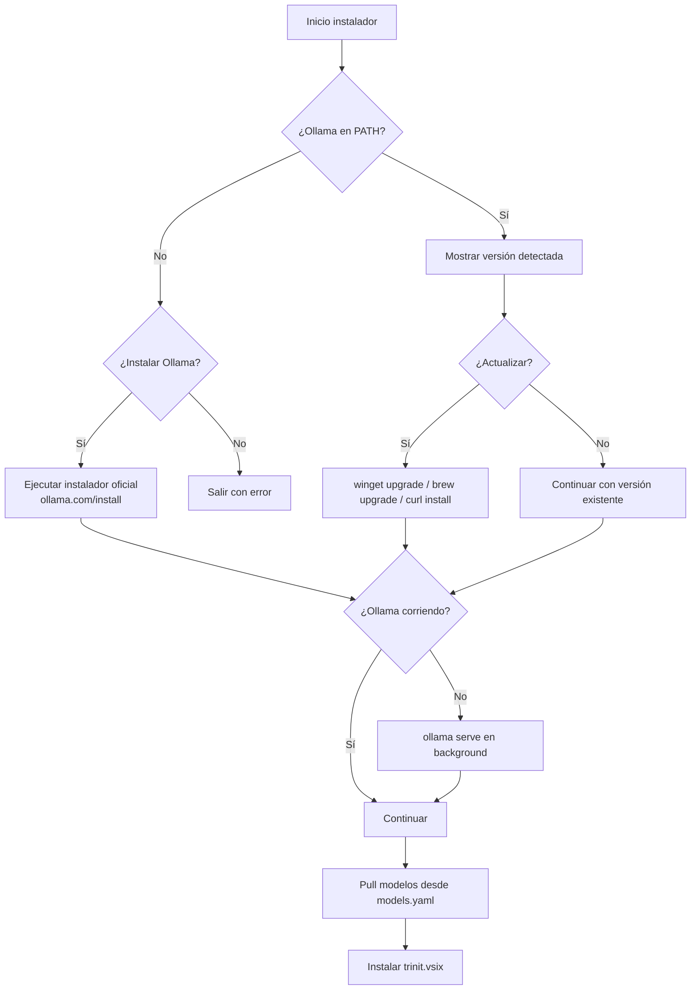

# Trinit — Arquitectura Técnica

> Versión: v0.1.0 · Fecha: 2026-07-04

---

## 1. Visión general del sistema

Trinit es un **monorepo** compuesto por tres componentes principales que trabajan juntos para ofrecer una experiencia de IA local completa:

```
trinit/                        ← Repositorio raíz (monorepo)
├── trinit-vscode/             ← Submodule: extensión VS Code (fork de Roo Code)
├── trinit-cli/                ← CLI TypeScript para gestión de modelos y setup
├── trinit-core/               ← Librería core: OllamaClient, ModelManager
├── models.yaml                ← Manifiesto de modelos (fuente de verdad)
├── install.ps1                ← Instalador Windows (one-liner)
└── install.sh                 ← Instalador macOS/Linux (one-liner)
```

### Submodule: trinit-vscode

El corazón de Trinit es un fork de **Roo Code** (a su vez fork de Cline), rebrandeado y modificado para operar sin login ni cloud. Es a su vez un monorepo interno con la siguiente estructura:

```
trinit-vscode/
├── src/                       ← Extension host VS Code (TypeScript/Node.js)
│   ├── extension.ts           ← Punto de entrada, activación
│   ├── core/webview/          ← ClineProvider: orquestador principal
│   ├── api/providers/         ← Handlers por proveedor (ollama.ts, etc.)
│   ├── services/              ← MCP, marketplace, modos, auth (eliminado)
│   ├── shared/                ← Constantes, localModeBindings.ts
│   └── assets/marketplace/   ← teams.yml, modes.yml, mcps.yml
├── webview-ui/                ← Frontend React/Vite (panel lateral VS Code)
├── packages/
│   ├── types/                 ← Schemas Zod + tipos TypeScript compartidos
│   ├── core/                  ← Lógica de agente agnóstica de plataforma
│   ├── cloud/                 ← Stub neutralizado (sin funcionalidad activa)
│   ├── ipc/                   ← Comunicación CLI ↔ extensión
│   └── telemetry/             ← Wrapper PostHog (desactivado en local)
└── apps/
    ├── cli/                   ← CLI standalone del agente
    └── vscode-e2e/            ← Tests E2E de la extensión
```

---

## 2. Diagrama de componentes


---

## 3. Flujo de datos local

Todo el flujo de datos permanece dentro de la máquina del usuario:



**Puntos clave del flujo:**
- No hay ninguna llamada a servidores externos en el flujo por defecto
- Ollama corre en `http://localhost:11434` (configurable vía `ollamaBaseUrl`)
- El streaming de tokens es Server-Sent Events (SSE) local
- El historial de tareas se persiste en `globalStorage` de VS Code (local)

---

## 4. Integración con Ollama

### Detección y arranque

El instalador (`install.ps1` / `install.sh`) detecta si Ollama está instalado antes de proceder:



### Comunicación con Ollama

El handler `src/api/providers/ollama.ts` usa el paquete npm `ollama` para comunicarse con el daemon local. La URL base es `http://localhost:11434` por defecto, configurable por el usuario.

Los modelos disponibles se descubren dinámicamente via `GET /api/tags` — Ollama es un `localProvider` en el sistema de caché de modelos, lo que significa que se consulta directamente sin autenticación.

---

## 5. Sistema de perfiles de proveedor y vinculación de modos

El `ProviderSettingsManager` mantiene un mapa persistente en `SecretStorage` de VS Code:

```typescript
// Estructura simplificada del schema
{
  currentApiConfigName: string,
  apiConfigs: Record<string, ProviderSettings>,  // perfiles nombrados
  modeApiConfigs: Record<string, string>,         // modeSlug → configId
  modeApiConfigLocks: Record<string, boolean>,    // modeSlug → bloqueado en local
}
```

El toggle global **Full Local / Custom** en `ModesView.tsx` llama a dos métodos de `ProviderSettingsManager`:

- **`applyFullLocalPreset()`** — bloquea todos los modos (`modeApiConfigLocks[mode] = true`) y resuelve cada modelo desde `LOCAL_MODE_BINDINGS` en `src/shared/localModeBindings.ts`:

```typescript
export const LOCAL_MODE_BINDINGS: Record<string, string> = {
    architect:    "ornith:9b",
    ocr:          "glm-ocr:latest",
    orchestrator: "ornith:9b",
    code:         "ornith:9b",
    debug:        "ornith:9b",
    ask:          "gemma4:e2b",
}
```

- **`applyCustomPreset()`** — desbloquea `architect` y `orchestrator` por defecto, dejando el resto en local. El usuario puede entonces asignar cualquier proveedor externo a los modos desbloqueados, o desbloquear modos adicionales individualmente desde la UI.

---

## 6. Sistema de Teams y Marketplace

El marketplace es **100% local** — no hay ningún registry remoto. Los datos se cargan desde archivos YAML empaquetados dentro de la extensión:

| Archivo | Contenido | Tamaño aprox. |
|---|---|---|
| `src/assets/marketplace/teams.yml` | Teams predefinidos (Trinit Core Team) | ~20 líneas |
| `src/assets/marketplace/modes.yml` | Catálogo de modos de la comunidad | 4.486 líneas |
| `src/assets/marketplace/mcps.yml` | Catálogo de servidores MCP | 3.032 líneas |

El `MarketplaceManager` orquesta la carga via `ConfigLoader` y la instalación via `SimpleInstaller`. La instalación de un Team escribe en `.roomodes` (scope de proyecto) o en `custom_modes.yaml` global, y llama a `setModeConfig()` para vincular cada modo a su modelo Ollama correspondiente.

---

## 7. MCPs predefinidos

En la primera activación, `seedDefaultMcpServers()` escribe en `mcp_settings.json` (global storage de VS Code) los siguientes servidores MCP, todos sin configuración adicional:

| Servidor | Comando | Propósito |
|---|---|---|
| `filesystem` | `npx @modelcontextprotocol/server-filesystem` | Acceso al sistema de archivos del workspace |
| `fetch` | `uvx mcp-server-fetch` | Peticiones HTTP desde el agente |
| `git` | `uvx mcp-server-git` | Operaciones Git |
| `memory` | `npx @modelcontextprotocol/server-memory` | Memoria persistente entre sesiones |
| `sequential-thinking` | `npx @modelcontextprotocol/server-sequential-thinking` | Razonamiento paso a paso |

El seeding es **estrictamente una vez** (guardado por `mcpDefaultsSeeded` en `globalState`) — si el usuario elimina un servidor, no reaparece en la siguiente activación.

---

## 8. Linaje del fork

```
Cline (original)
    └── Roo Code (fork con multi-modo, marketplace, cloud)
            └── Zoo Code (rebrand intermedio)
                    └── Trinit (fork actual — rebrand completado)
                            ├── Auth/login eliminado
                            ├── Ollama como proveedor por defecto
                            ├── 6 modos con vinculación local
                            ├── Teams marketplace
                            └── MCPs predefinidos
```

El rebrand de Roo Code → Trinit está **completado**: ~762 archivos renombrados/actualizados, paquetes migrados de `@roo-code/*` a `@trinit/*`, 18 locales actualizados, `roleDefinitions` con "You are Trinit", y todos los commits pusheados. `zoo-code-index.md` es un documento histórico de planificación del proceso de rebrand, no refleja el estado actual del código.

---

## 9. Build y empaquetado

| Herramienta | Uso |
|---|---|
| `pnpm` | Gestor de paquetes (workspace monorepo) |
| `turbo` | Pipeline de build paralelo |
| `esbuild` | Bundle de la extensión (`src/esbuild.mjs`) |
| `vite` | Build del webview React (`webview-ui/vite.config.ts`) |
| `tsc` | Compilación TypeScript del CLI |

El artefacto final es `trinit.vsix`, distribuido vía GitHub Releases. La extensión se instala con `code --install-extension trinit.vsix`.
