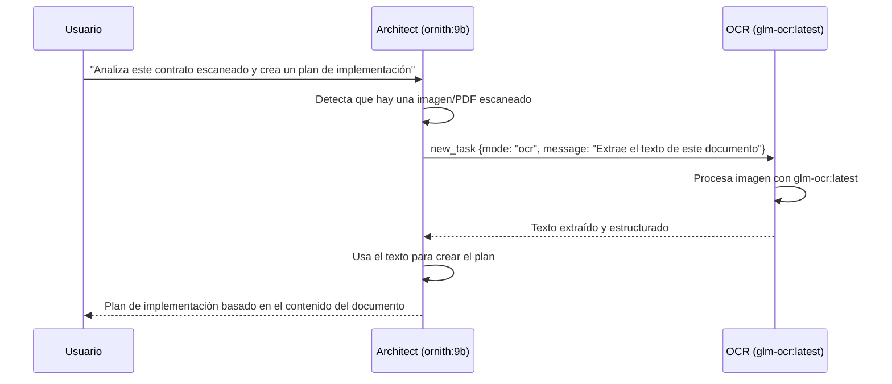

# Trinit — Features Detalladas

> Versión: v0.1.0 · Fecha: 2026-07-04  
> Fuente: `trinit-vscode/packages/types/src/mode.ts`, `src/shared/localModeBindings.ts`, `src/assets/marketplace/teams.yml`, `src/services/mcp/defaultMcpServers.ts`

---

## 1. Modos / Agentes

Trinit organiza la IA en **6 modos especializados**, cada uno con un rol, herramientas y modelo local diferente. Los modos son `DEFAULT_MODES` — siempre presentes, sin necesidad de instalación adicional.

### 1.1 Tabla de modos

| Modo | Slug | Modelo local | Herramientas disponibles | Propósito |
|---|---|---|---|---|
| 🏗️ Architect | `architect` | `ornith:9b` | read, edit (solo .md), mcp | Planificación, diseño técnico, especificaciones |
| 🪃 Orchestrator | `orchestrator` | `ornith:9b` | *(ninguna directa)* | Coordinación de subtareas entre modos |
| 💻 Code | `code` | `ornith:9b` | read, edit, command, mcp | Escritura, modificación y refactoring de código |
| 🪲 Debug | `debug` | `ornith:9b` | read, edit, command, mcp | Diagnóstico y resolución de bugs |
| ❓ Ask | `ask` | `gemma4:e2b` | read, mcp | Preguntas, explicaciones, análisis sin modificar código |
| 🔎 OCR | `ocr` | `glm-ocr:latest` | read, edit (solo .md/.txt/.json) | Extracción de texto de imágenes y documentos |

### 1.2 Descripción detallada de cada modo

#### 🏗️ Architect
El modo de planificación. Recopila contexto, hace preguntas clarificadoras, crea listas de tareas estructuradas con `update_todo_list`, y diseña la arquitectura antes de implementar. **Delega automáticamente a OCR** cuando la tarea involucra imágenes o documentos escaneados (instrucción explícita en `customInstructions`). Finaliza sugiriendo al usuario cambiar a otro modo para implementar.

Restricción de edición: solo puede modificar archivos `.md` — no puede tocar código directamente, lo que garantiza que su rol sea exclusivamente de planificación.

#### 🪃 Orchestrator
El coordinador de flujos complejos. No tiene acceso directo a herramientas de edición o comandos — su único mecanismo de acción es `new_task`, con el que delega subtareas a los modos más apropiados. Ideal para proyectos multi-etapa que requieren coordinación entre especialidades.

#### 💻 Code
El implementador. Acceso completo a lectura, escritura de archivos, ejecución de comandos de terminal y MCPs. Es el modo de trabajo principal para desarrollo de software.

#### 🪲 Debug
Especialista en diagnóstico sistemático. Su `customInstructions` le indica explícitamente: reflexionar sobre 5-7 posibles causas, reducirlas a 1-2 más probables, añadir logs para validar, y **pedir confirmación al usuario antes de aplicar el fix**. Esto evita correcciones precipitadas.

#### ❓ Ask
Modo de consulta pura. Solo puede leer archivos y usar MCPs — no puede modificar nada. Usa `gemma4:e2b` (modelo más ligero) porque las preguntas y explicaciones no requieren la capacidad de razonamiento agentico de `ornith:9b`.

#### 🔎 OCR
Modo especializado en visión computacional. Usa `glm-ocr:latest` (modelo multimodal de 0.9B parámetros, #1 en OmniDocBench) para extraer texto estructurado de imágenes, PDFs escaneados, capturas de pantalla y fotografías de documentos. Solo puede escribir en archivos `.md`, `.txt` y `.json` — los formatos naturales de salida de una extracción OCR.

---

## 2. Full Local vs. Custom

Trinit tiene dos modos de operación globales, seleccionables desde un **toggle global en `ModesView.tsx`**. El cambio entre modos aplica presets completos via `applyFullLocalPreset()` / `applyCustomPreset()` en `ProviderSettingsManager`.

### Full Local (modo por defecto)

En Full Local, **cada modo está vinculado a un modelo Ollama específico** y ese vínculo no puede ser cambiado accidentalmente desde la UI. La tabla de vinculaciones está definida en `src/shared/localModeBindings.ts`:

```typescript
export const LOCAL_MODE_BINDINGS: Record<string, string> = {
    architect:    "ornith:9b",
    ocr:          "glm-ocr:latest",
    orchestrator: "ornith:9b",
    code:         "ornith:9b",
    debug:        "ornith:9b",
    ask:          "gemma4:e2b",
}
```

`applyFullLocalPreset()` bloquea todos los modos (`modeApiConfigLocks[mode] = true`) y resuelve cada modelo desde esta tabla. Cuando un modo está bloqueado, el selector de configuración API aparece deshabilitado en la UI — el usuario no puede cambiarlo accidentalmente.

### Custom (modo avanzado)

`applyCustomPreset()` desbloquea **architect y orchestrator por defecto** (`modeApiConfigLocks = false` para esos dos modos), dejando el resto en local. El usuario puede entonces asignar cualquier proveedor externo (OpenAI, Anthropic, OpenRouter, etc.) a los modos desbloqueados.

El desbloqueo es **por modo individual** — se puede desbloquear solo `architect` para usar GPT-4o en planificación, mientras el resto sigue en local. En `ModesView.tsx`, cada modo muestra un indicador de candado: al hacer clic en él se alterna `modeApiConfigLocks[mode]` y el selector de configuración API se habilita o deshabilita.

**Importante:** Desbloquear un modo no borra la vinculación local — si el usuario vuelve a bloquear el modo, recupera inmediatamente el modelo local anterior.

---

## 3. Vinculación de modelos por modo (tabla completa)

| Modo | Full Local (por defecto) | Custom (si desbloqueado) |
|---|---|---|
| architect | `ornith:9b` | Cualquier modelo del proveedor configurado |
| orchestrator | `ornith:9b` | Cualquier modelo del proveedor configurado |
| code | `ornith:9b` | Cualquier modelo del proveedor configurado |
| debug | `ornith:9b` | Cualquier modelo del proveedor configurado |
| ask | `gemma4:e2b` | Cualquier modelo del proveedor configurado |
| ocr | `glm-ocr:latest` | Cualquier modelo del proveedor configurado |

---

## 4. Delegación OCR desde Architect

El modo Architect tiene una instrucción explícita en su `customInstructions`:

> "Si la solicitud del usuario involucra leer o extraer información de imágenes, documentos escaneados, capturas de pantalla o páginas fotografiadas, delega esa subtarea al modo `ocr` via la herramienta `new_task` antes de continuar con el resto del plan."

Este flujo de delegación funciona así:



### Pipeline OCR a nivel de implementación

El flujo real en código: Architect detecta input visual y delega vía `new_task` → `delegateParentAndOpenChild` crea el child en modo `ocr` → el modo OCR envía la imagen (base64) a `glm-ocr:latest` en Ollama → el texto extraído se escribe solo en `.md`/`.txt`/`.json` → `attempt_completion` dispara `resumeAfterDelegation` que restaura Architect con el resultado.


---

## 5. Teams Marketplace

### Concepto

Un **Team** es un conjunto curado de modos con sus vinculaciones de modelo. Instalar un Team activa todos sus modos y configura automáticamente los modelos correspondientes.

### Trinit Core Team (incluido por defecto)

El único team incluido en v0.1.0, definido en `src/assets/marketplace/teams.yml`:

```yaml
- id: team-trinit-core
  name: Trinit Core Team
  description: >-
    The default Trinit team — architect and orchestrator for planning, plus
    code, debug, ask, and a dedicated OCR specialist, all running on the
    Full Local (Ollama) model bindings.
  tags: [default, general]
  modes:
    - slug: architect    → ornith:9b
    - slug: orchestrator → ornith:9b
    - slug: code         → ornith:9b
    - slug: debug        → ornith:9b
    - slug: ask          → gemma4:e2b
    - slug: ocr          → glm-ocr:latest
```

### Flujo de instalación de un Team

`SimpleInstaller.installTeam()` itera los modos del team y, para cada uno, crea/recupera un perfil local vinculado al modelo de `LOCAL_MODE_BINDINGS`, lo asigna al modo, y bloquea el binding (`modeApiConfigLocks[mode] = true`). No escribe archivos de modos — los modos del team son siempre `DEFAULT_MODES` ya presentes; solo toca estado en `ProviderSettingsManager`.


### Estructura del marketplace

El marketplace tiene tres pestañas:
- **Teams**: conjuntos de modos preconfigurados
- **Modes**: modos individuales de la comunidad (catálogo de 4.486 líneas en `modes.yml`)
- **MCPs**: servidores MCP de la comunidad (catálogo de 3.032 líneas en `mcps.yml`)

Todo el catálogo es **local** — no hay llamadas a ningún registry remoto. Los archivos YAML están empaquetados dentro de la extensión.

---

## 6. MCPs Predefinidos

En la primera activación, Trinit configura automáticamente 5 servidores MCP sin requerir ninguna configuración adicional del usuario:

| Servidor | Comando | Descripción |
|---|---|---|
| `filesystem` | `npx -y @modelcontextprotocol/server-filesystem ${workspaceFolder}` | Acceso al sistema de archivos del proyecto actual |
| `fetch` | `uvx mcp-server-fetch` | Permite al agente hacer peticiones HTTP |
| `git` | `uvx mcp-server-git` | Operaciones Git (log, diff, blame, etc.) |
| `memory` | `npx -y @modelcontextprotocol/server-memory` | Memoria persistente entre sesiones de chat |
| `sequential-thinking` | `npx -y @modelcontextprotocol/server-sequential-thinking` | Razonamiento estructurado paso a paso |

**Requisitos:** `npx` (incluido con Node.js) y `uvx` (incluido con uv/Python). Si alguno no está disponible, McpHub marca el servidor como "disconnected" con un mensaje de error — no bloquea la activación de la extensión.

**Seeding único:** El flag `mcpDefaultsSeeded` en `globalState` garantiza que el seeding ocurre exactamente una vez. Si el usuario elimina un servidor, no reaparece en la siguiente activación.

---

## 7. Administración de proveedores (preservada intacta)

Aunque Trinit elimina el login y el proveedor `trinit-gateway`, **toda la infraestructura de administración de proveedores de Roo Code se preserva intacta**:

- Crear, renombrar, eliminar y cambiar entre perfiles de API
- Configurar OpenAI, Anthropic, Ollama, OpenRouter, AWS Bedrock, Google Vertex, y todos los demás proveedores soportados
- El selector de configuración API por modo en `ModesView.tsx`
- La UI de "API Configuration" en Settings

Esto significa que Trinit es compatible con cualquier proveedor que Roo Code soporta — simplemente no requiere ninguno para funcionar.

---

## 8. Soporte de idiomas

La extensión incluye documentación localizada en **17 idiomas**:
`ca`, `de`, `es`, `fr`, `hi`, `id`, `it`, `ja`, `ko`, `nl`, `pl`, `pt-BR`, `ru`, `tr`, `vi`, `zh-CN`, `zh-TW`

La interfaz de usuario de la extensión hereda la localización de VS Code.
