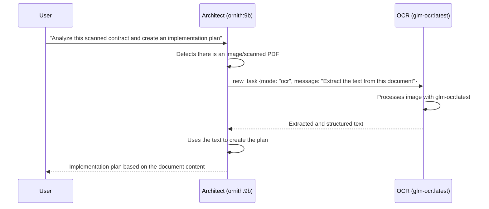
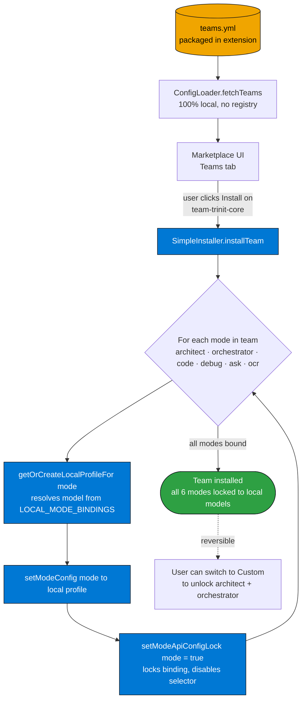

# Trinit — Detailed Features

> Version: v0.1.0 · Date: 2026-07-04  
> Source: `trinit-vscode/packages/types/src/mode.ts`, `src/shared/localModeBindings.ts`, `src/assets/marketplace/teams.yml`, `src/services/mcp/defaultMcpServers.ts`

---

## 1. Modes / Agents

Trinit organizes AI into **6 specialized modes**, each with a different role, set of tools, and local model. The modes are `DEFAULT_MODES` — always present, with no need for additional installation.

### 1.1 Modes table

| Mode | Slug | Local model | Available tools | Purpose |
|---|---|---|---|---|
| 🏗️ Architect | `architect` | `ornith:9b` | read, edit (.md only), mcp | Planning, technical design, specifications |
| 🪃 Orchestrator | `orchestrator` | `ornith:9b` | *(none direct)* | Coordination of subtasks across modes |
| 💻 Code | `code` | `ornith:9b` | read, edit, command, mcp | Writing, modifying, and refactoring code |
| 🪲 Debug | `debug` | `ornith:9b` | read, edit, command, mcp | Diagnosis and resolution of bugs |
| ❓ Ask | `ask` | `gemma4:e2b` | read, mcp | Questions, explanations, analysis without modifying code |
| 🔎 OCR | `ocr` | `glm-ocr:latest` | read, edit (.md/.txt/.json only) | Text extraction from images and documents |

### 1.2 Detailed description of each mode

#### 🏗️ Architect
The planning mode. It gathers context, asks clarifying questions, creates structured task lists with `update_todo_list`, and designs the architecture before implementing. **Automatically delegates to OCR** when the task involves images or scanned documents (explicit instruction in `customInstructions`). It finishes by suggesting the user switch to another mode to implement.

Edit restriction: it can only modify `.md` files — it cannot touch code directly, ensuring its role remains exclusively planning.

#### 🪃 Orchestrator
The coordinator of complex flows. It has no direct access to editing tools or commands — its only mechanism of action is `new_task`, with which it delegates subtasks to the most appropriate modes. Ideal for multi-stage projects requiring coordination across specialties.

#### 💻 Code
The implementer. Full access to file reading, file writing, terminal command execution, and MCPs. It is the primary working mode for software development.

#### 🪲 Debug
A specialist in systematic diagnosis. Its `customInstructions` explicitly tell it to: reflect on 5–7 possible causes, narrow them down to the 1–2 most likely, add logs to validate, and **ask the user for confirmation before applying the fix**. This prevents hasty corrections.

#### ❓ Ask
A pure consultation mode. It can only read files and use MCPs — it cannot modify anything. It uses `gemma4:e2b` (a lighter model) because questions and explanations do not require the agentic reasoning capability of `ornith:9b`.

#### 🔎 OCR
A mode specialized in computer vision. It uses `glm-ocr:latest` (a 0.9B-parameter multimodal model, #1 on OmniDocBench) to extract structured text from images, scanned PDFs, screenshots, and photographs of documents. It can only write to `.md`, `.txt`, and `.json` files — the natural output formats of an OCR extraction.

---

## 2. Full Local vs. Custom

Trinit has two global operating modes, selectable from a **global toggle in `ModesView.tsx`**. Switching between modes applies complete presets via `applyFullLocalPreset()` / `applyCustomPreset()` in `ProviderSettingsManager`.

### Full Local (default mode)

In Full Local, **each mode is bound to a specific Ollama model** and that binding cannot be changed accidentally from the UI. The binding table is defined in `src/shared/localModeBindings.ts`:

```typescript
export const LOCAL_MODE_BINDINGS: Record<string, string> = {
    architect:    "ornith:9b",
    ocr:          "glm-ocr:latest",
    orchestrator: "ornith:9b",
    code:         "ornith:9b",
    debug:        "ornith:9b",
    ask:          "gemma4:e2b",
}
```

`applyFullLocalPreset()` locks all modes (`modeApiConfigLocks[mode] = true`) and resolves each model from this table. When a mode is locked, the API configuration selector appears disabled in the UI — the user cannot change it accidentally.

### Custom (advanced mode)

`applyCustomPreset()` unlocks **architect and orchestrator by default** (`modeApiConfigLocks = false` for those two modes), leaving the rest on local. The user can then assign any external provider (OpenAI, Anthropic, OpenRouter, etc.) to the unlocked modes.

Unlocking is **per individual mode** — you can unlock only `architect` to use GPT-4o for planning, while the rest stay local. In `ModesView.tsx`, each mode displays a lock indicator: clicking it toggles `modeApiConfigLocks[mode]` and the API configuration selector is enabled or disabled accordingly.

**Important:** Unlocking a mode does not delete the local binding — if the user re-locks the mode, the previous local model is immediately restored.

---

## 3. Model binding per mode (full table)

| Mode | Full Local (default) | Custom (if unlocked) |
|---|---|---|
| architect | `ornith:9b` | Any model from the configured provider |
| orchestrator | `ornith:9b` | Any model from the configured provider |
| code | `ornith:9b` | Any model from the configured provider |
| debug | `ornith:9b` | Any model from the configured provider |
| ask | `gemma4:e2b` | Any model from the configured provider |
| ocr | `glm-ocr:latest` | Any model from the configured provider |

---

## 4. OCR delegation from Architect

The Architect mode has an explicit instruction in its `customInstructions`:

> "If the user's request involves reading or extracting information from images, scanned documents, screenshots, or photographed pages, delegate that subtask to the `ocr` mode via the `new_task` tool before continuing with the rest of the plan."

This delegation flow works as follows:



### OCR pipeline at the implementation level

The actual flow in code: Architect detects visual input and delegates via `new_task` → `delegateParentAndOpenChild` creates the child in `ocr` mode → the OCR mode sends the image (base64) to `glm-ocr:latest` in Ollama → the extracted text is written only to `.md`/`.txt`/`.json` → `attempt_completion` triggers `resumeAfterDelegation` which restores Architect with the result.


---

## 5. Teams Marketplace

### Concept

A **Team** is a curated set of modes along with their model bindings. Installing a Team activates all its modes and automatically configures the corresponding models.

### Trinit Core Team (included by default)

The only team included in v0.1.0, defined in `src/assets/marketplace/teams.yml`:

```yaml
- id: team-trinit-core
  name: Trinit Core Team
  description: >-
    The default Trinit team — architect and orchestrator for planning, plus
    code, debug, ask, and a dedicated OCR specialist, all running on the
    Full Local (Ollama) model bindings.
  tags: [default, general]
  modes:
    - slug: architect    → ornith:9b
    - slug: orchestrator → ornith:9b
    - slug: code         → ornith:9b
    - slug: debug        → ornith:9b
    - slug: ask          → gemma4:e2b
    - slug: ocr          → glm-ocr:latest
```

### Team installation flow

`SimpleInstaller.installTeam()` iterates the team's modes and, for each one, creates/retrieves a local profile bound to the model from `LOCAL_MODE_BINDINGS`, assigns it to the mode, and locks the binding (`modeApiConfigLocks[mode] = true`). It does not write mode files — the team's modes are always `DEFAULT_MODES` already present; it only touches state in `ProviderSettingsManager`.



### Marketplace structure

The marketplace has three tabs:
- **Teams**: preconfigured sets of modes
- **Modes**: individual community modes (4,486-line catalog in `modes.yml`)
- **MCPs**: community MCP servers (3,032-line catalog in `mcps.yml`)

The entire catalog is **local** — there are no calls to any remote registry. The YAML files are packaged inside the extension.

---

## 6. Predefined MCPs

On first activation, Trinit automatically configures 5 MCP servers without requiring any additional configuration from the user:

| Server | Command | Description |
|---|---|---|
| `filesystem` | `npx -y @modelcontextprotocol/server-filesystem ${workspaceFolder}` | Access to the current project's filesystem |
| `fetch` | `uvx mcp-server-fetch` | Lets the agent make HTTP requests |
| `git` | `uvx mcp-server-git` | Git operations (log, diff, blame, etc.) |
| `memory` | `npx -y @modelcontextprotocol/server-memory` | Persistent memory across chat sessions |
| `sequential-thinking` | `npx -y @modelcontextprotocol/server-sequential-thinking` | Structured step-by-step reasoning |

**Requirements:** `npx` (included with Node.js) and `uvx` (included with uv/Python). If either is unavailable, McpHub marks the server as "disconnected" with an error message — it does not block extension activation.

**One-time seeding:** The `mcpDefaultsSeeded` flag in `globalState` ensures seeding happens exactly once. If the user removes a server, it does not reappear on the next activation.

---

## 7. Provider management (preserved intact)

Although Trinit removes login and the `trinit-gateway` provider, **the entire provider management infrastructure from Roo Code is preserved intact**:

- Create, rename, delete, and switch between API profiles
- Configure OpenAI, Anthropic, Ollama, OpenRouter, AWS Bedrock, Google Vertex, and all other supported providers
- The per-mode API configuration selector in `ModesView.tsx`
- The "API Configuration" UI in Settings

This means Trinit is compatible with any provider Roo Code supports — it simply requires none of them to function.

---

## 8. Language support

The extension includes localized documentation in **17 languages**:
`ca`, `de`, `es`, `fr`, `hi`, `id`, `it`, `ja`, `ko`, `nl`, `pl`, `pt-BR`, `ru`, `tr`, `vi`, `zh-CN`, `zh-TW`

The extension's user interface inherits VS Code's localization.
