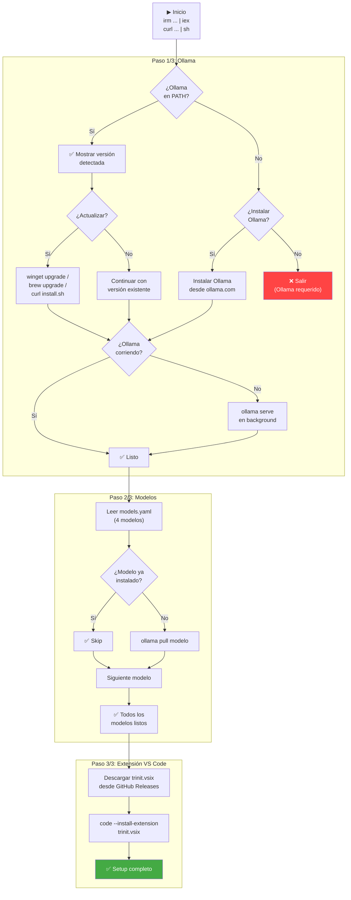

# Trinit — Experiencia de Instalación

> Versión: v0.1.0 · Fecha: 2026-07-04  
> Fuente: `install.ps1`, `install.sh`, `trinit-cli/src/index.ts`, `models.yaml`

---

## 1. One-liner por plataforma

### Windows (PowerShell)

```powershell
irm https://raw.githubusercontent.com/Danelaton/trinit/main/install.ps1 | iex
```

### macOS / Linux (bash/sh)

```bash
curl -fsSL https://raw.githubusercontent.com/Danelaton/trinit/main/install.sh | sh
```

Eso es todo. Un comando instala Ollama (si no está), descarga los 4 modelos y configura la extensión VS Code.

---

## 2. Flujo inteligente del instalador

El instalador tiene lógica de detección en cada paso para evitar trabajo innecesario:



---

## 3. Qué instala exactamente

### Paso 1: Ollama

| Acción | Condición |
|---|---|
| Detectar Ollama en PATH | Siempre |
| Mostrar versión detectada | Si Ollama está instalado |
| Preguntar si actualizar | Si Ollama está instalado (default: No) |
| Instalar Ollama | Si no está instalado (default: Sí) |
| Arrancar `ollama serve` | Si Ollama no está corriendo |
| Esperar hasta 15 segundos | Hasta que `http://localhost:11434` responda |

**Métodos de instalación de Ollama por plataforma:**
- **Windows:** `winget upgrade --id Ollama.Ollama` (con fallback a `irm https://ollama.com/install.ps1 | iex`)
- **macOS:** `brew upgrade ollama` (con fallback a `curl -fsSL https://ollama.com/install.sh | sh`)
- **Linux:** `curl -fsSL https://ollama.com/install.sh | sh`

### Paso 2: Modelos

El instalador lee `models.yaml` para obtener la lista de modelos. Si no puede leer el archivo, usa una lista hardcodeada de fallback:

```
glm-ocr:latest   (2.2 GB)
gemma4:e2b       (7.2 GB)
gemma4:e4b       (9.6 GB)
ornith:9b        (5.6 GB)
```

Para cada modelo:
1. Consulta `ollama list` para ver si ya está instalado
2. Si está instalado: muestra `✅ ya instalado` y continúa
3. Si no está instalado: ejecuta `ollama pull <modelo>` con barra de progreso

**Tiempo estimado de descarga** (conexión de 100 Mbps):
- `glm-ocr:latest`: ~3 minutos
- `ornith:9b`: ~7 minutos
- `gemma4:e2b`: ~9 minutos
- `gemma4:e4b`: ~12 minutos
- **Total (primera instalación):** ~30 minutos

### Paso 3: Extensión VS Code

1. Descarga `trinit.vsix` desde `https://github.com/Danelaton/trinit/releases/latest/download/trinit.vsix`
2. Ejecuta `code --install-extension trinit.vsix`
3. Elimina el archivo `.vsix` temporal

**Tamaño del artefacto:** `trinit.vsix` pesa **34.083.603 bytes (~34 MB)** — verificado con HTTP 200 + `Content-Length` en el asset del release v0.1.0.

**Requisito:** VS Code debe estar instalado y el comando `code` disponible en PATH.

---

## 4. Modo no-interactivo

El instalador detecta automáticamente si está corriendo en modo no-interactivo (cuando stdin no es un TTY, como ocurre al hacer pipe con `irm | iex` o `curl | sh`). En ese caso:

- **Ollama no instalado:** instala automáticamente (default: Sí)
- **Ollama instalado:** no actualiza (default: No)
- **Modelos:** descarga todos los que falten sin preguntar

Para forzar el modo no-interactivo explícitamente:

```powershell
# Windows
irm https://raw.githubusercontent.com/Danelaton/trinit/main/install.ps1 | iex -Yes
# o
$env:TRINIT_YES = "1"; irm ... | iex
```

```bash
# macOS/Linux
curl -fsSL https://raw.githubusercontent.com/Danelaton/trinit/main/install.sh | sh -s -- --yes
# o
TRINIT_YES=1 curl -fsSL ... | sh
```

---

## 5. CLI de Trinit (trinit-cli)

Además de los scripts de instalación, Trinit incluye un CLI TypeScript para gestión avanzada:

```bash
# Instalar el CLI (requiere Node.js)
npm install -g trinit-cli

# Comandos disponibles
trinit setup          # Setup completo (Ollama + modelos + extensión)
trinit install        # Solo instalar/actualizar Ollama
trinit pull           # Descargar todos los modelos del manifiesto
trinit pull ornith:9b # Descargar un modelo específico
trinit list           # Listar modelos instalados en Ollama
trinit status         # Estado de Ollama y modelos
```

El CLI usa `trinit-core` (librería interna) que expone `OllamaClient` y `ModelManager` para interactuar con Ollama programáticamente.

---

## 6. Primera activación de la extensión

Al abrir VS Code después de la instalación, la extensión realiza automáticamente:

1. **Seeding de MCPs:** Escribe 5 servidores MCP predefinidos en `mcp_settings.json` (solo si no hay servidores configurados)
2. **Seeding de perfiles de modelo:** Crea perfiles Ollama para cada modo (`trinit-local-architect`, `trinit-local-ocr`, etc.)
3. **Vinculación de modos:** Establece `modeApiConfigs` para cada modo con su modelo local correspondiente
4. **Bloqueo Full Local:** Inicializa `modeApiConfigLocks` con todos los modos bloqueados

Todo esto ocurre en background durante la activación, sin interrumpir al usuario.

---

## 7. Troubleshooting común

### "code: command not found"

VS Code no está en PATH. Soluciones:
- **Windows:** Reinstalar VS Code marcando "Add to PATH"
- **macOS:** Abrir VS Code → Command Palette → "Shell Command: Install 'code' command in PATH"
- **Linux:** Verificar que `/usr/bin/code` o `/usr/local/bin/code` existe

### "Ollama installed but not running"

El instalador intenta arrancar Ollama automáticamente. Si falla:

```bash
# macOS/Linux
ollama serve &

# Windows (PowerShell)
Start-Process "ollama" -ArgumentList "serve" -WindowStyle Hidden
```

### "Could not read models.yaml"

Ocurre cuando el instalador se ejecuta desde un directorio diferente al del repositorio. El instalador tiene un fallback hardcodeado con los 4 modelos, por lo que la instalación continúa normalmente.

### Modelo descargado parcialmente

Si una descarga se interrumpe, `ollama pull` puede reanudarla. Simplemente vuelve a ejecutar:

```bash
ollama pull ornith:9b
```

### La extensión no aparece en VS Code

1. Verificar que la instalación completó: `code --list-extensions | grep trinit`
2. Recargar VS Code: `Ctrl+Shift+P` → "Developer: Reload Window"
3. Reinstalar manualmente: descargar `trinit.vsix` de GitHub Releases y ejecutar `code --install-extension trinit.vsix`

### Ollama no responde en `localhost:11434`

```bash
# Verificar que Ollama está corriendo
curl http://localhost:11434

# Si no responde, arrancar manualmente
ollama serve
```

### Espacio en disco insuficiente

Los 4 modelos requieren ~24.5 GB. Para instalar solo los modelos esenciales:

```bash
# Solo OCR y coding (mínimo funcional)
ollama pull glm-ocr:latest   # 2.2 GB
ollama pull ornith:9b        # 5.6 GB
# Total: ~7.8 GB
```

Luego configurar manualmente el modo `ask` para usar `ornith:9b` en lugar de `gemma4:e2b`.
