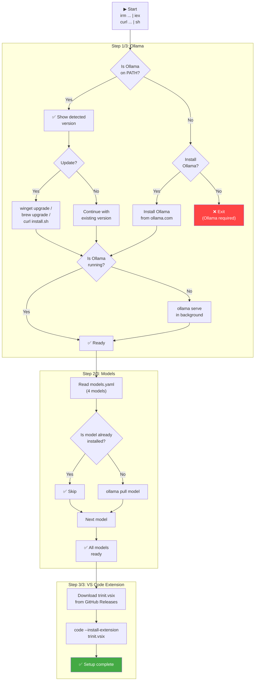

# Trinit — Installation Experience

> Version: v0.1.0 · Date: 2026-07-04  
> Source: `install.ps1`, `install.sh`, `trinit-cli/src/index.ts`, `models.yaml`

---

## 1. One-liner per platform

### Windows (PowerShell)

```powershell
irm https://raw.githubusercontent.com/Danelaton/trinit/main/install.ps1 | iex
```

### macOS / Linux (bash/sh)

```bash
curl -fsSL https://raw.githubusercontent.com/Danelaton/trinit/main/install.sh | sh
```

That's it. One command installs Ollama (if absent), downloads the 4 models, and configures the VS Code extension.

---

## 2. Smart installer flow

The installer has detection logic at each step to avoid unnecessary work:



---

## 3. What it installs exactly

### Step 1: Ollama

| Action | Condition |
|---|---|
| Detect Ollama on PATH | Always |
| Show detected version | If Ollama is installed |
| Ask to update | If Ollama is installed (default: No) |
| Install Ollama | If not installed (default: Yes) |
| Start `ollama serve` | If Ollama is not running |
| Wait up to 15 seconds | Until `http://localhost:11434` responds |

**Ollama installation methods per platform:**
- **Windows:** `winget upgrade --id Ollama.Ollama` (with fallback to `irm https://ollama.com/install.ps1 | iex`)
- **macOS:** `brew upgrade ollama` (with fallback to `curl -fsSL https://ollama.com/install.sh | sh`)
- **Linux:** `curl -fsSL https://ollama.com/install.sh | sh`

### Step 2: Models

The installer reads `models.yaml` to get the list of models. If it cannot read the file, it uses a hardcoded fallback list:

```
glm-ocr:latest   (2.2 GB)
gemma4:e2b       (7.2 GB)
gemma4:e4b       (9.6 GB)
ornith:9b        (5.6 GB)
```

For each model:
1. Queries `ollama list` to see if it is already installed
2. If installed: shows `✅ already installed` and continues
3. If not installed: runs `ollama pull <model>` with a progress bar

**Estimated download time** (100 Mbps connection):
- `glm-ocr:latest`: ~3 minutes
- `ornith:9b`: ~7 minutes
- `gemma4:e2b`: ~9 minutes
- `gemma4:e4b`: ~12 minutes
- **Total (first install):** ~30 minutes

### Step 3: VS Code extension

1. Downloads `trinit.vsix` from `https://github.com/Danelaton/trinit/releases/latest/download/trinit.vsix`
2. Runs `code --install-extension trinit.vsix`
3. Deletes the temporary `.vsix` file

**Artifact size:** `trinit.vsix` is **34,083,603 bytes (~34 MB)** — verified with HTTP 200 + `Content-Length` on the v0.1.0 release asset.

**Requirement:** VS Code must be installed and the `code` command available on PATH.

---

## 4. Non-interactive mode

The installer automatically detects whether it is running in non-interactive mode (when stdin is not a TTY, as happens when piping with `irm | iex` or `curl | sh`). In that case:

- **Ollama not installed:** installs automatically (default: Yes)
- **Ollama installed:** does not update (default: No)
- **Models:** downloads all missing ones without asking

To explicitly force non-interactive mode:

```powershell
# Windows
irm https://raw.githubusercontent.com/Danelaton/trinit/main/install.ps1 | iex -Yes
# or
$env:TRINIT_YES = "1"; irm ... | iex
```

```bash
# macOS/Linux
curl -fsSL https://raw.githubusercontent.com/Danelaton/trinit/main/install.sh | sh -s -- --yes
# or
TRINIT_YES=1 curl -fsSL ... | sh
```

---

## 5. Trinit CLI (trinit-cli)

In addition to the installation scripts, Trinit includes a TypeScript CLI for advanced management:

```bash
# Install the CLI (requires Node.js)
npm install -g trinit-cli

# Available commands
trinit setup          # Full setup (Ollama + models + extension)
trinit install        # Only install/update Ollama
trinit pull           # Download all models from the manifest
trinit pull ornith:9b # Download a specific model
trinit list           # List models installed in Ollama
trinit status         # Status of Ollama and models
```

The CLI uses `trinit-core` (internal library) which exposes `OllamaClient` and `ModelManager` to interact with Ollama programmatically.

---

## 6. First extension activation

When opening VS Code after installation, the extension automatically performs:

1. **MCP seeding:** Writes 5 predefined MCP servers to `mcp_settings.json` (only if no servers are configured)
2. **Model profile seeding:** Creates Ollama profiles for each mode (`trinit-local-architect`, `trinit-local-ocr`, etc.)
3. **Mode binding:** Sets `modeApiConfigs` for each mode with its corresponding local model
4. **Full Local lock:** Initializes `modeApiConfigLocks` with all modes locked

All of this happens in the background during activation, without interrupting the user.

---

## 7. Common troubleshooting

### "code: command not found"

VS Code is not on PATH. Solutions:
- **Windows:** Reinstall VS Code checking "Add to PATH"
- **macOS:** Open VS Code → Command Palette → "Shell Command: Install 'code' command in PATH"
- **Linux:** Verify that `/usr/bin/code` or `/usr/local/bin/code` exists

### "Ollama installed but not running"

The installer tries to start Ollama automatically. If it fails:

```bash
# macOS/Linux
ollama serve &

# Windows (PowerShell)
Start-Process "ollama" -ArgumentList "serve" -WindowStyle Hidden
```

### "Could not read models.yaml"

Happens when the installer is run from a directory different from the repository's. The installer has a hardcoded fallback with the 4 models, so installation continues normally.

### Partially downloaded model

If a download is interrupted, `ollama pull` can resume it. Simply run again:

```bash
ollama pull ornith:9b
```

### The extension does not appear in VS Code

1. Verify the installation completed: `code --list-extensions | grep trinit`
2. Reload VS Code: `Ctrl+Shift+P` → "Developer: Reload Window"
3. Reinstall manually: download `trinit.vsix` from GitHub Releases and run `code --install-extension trinit.vsix`

### Ollama not responding on `localhost:11434`

```bash
# Verify Ollama is running
curl http://localhost:11434

# If it doesn't respond, start it manually
ollama serve
```

### Insufficient disk space

The 4 models require ~24.5 GB. To install only the essential models:

```bash
# Only OCR and coding (minimum functional)
ollama pull glm-ocr:latest   # 2.2 GB
ollama pull ornith:9b        # 5.6 GB
# Total: ~7.8 GB
```

Then manually configure the `ask` mode to use `ornith:9b` instead of `gemma4:e2b`.
